# Scripts 依赖关系图

## 引用层级

```mermaid
graph TD
    subgraph "入口层"
        RC["Raycast Commands<br/>(60+ wrappers)"]
        HOOK["Claude Code Hooks"]
        SKILL["Claude Commands<br/>(/promote, /repo-map)"]
        CLI["命令行直接调用"]
    end

    subgraph "脚本层 — document/ (20)"
        md_tools["md_tools.py<br/>MD 格式/合并/拆分/转换<br/>⭐ 62次 | 4个wrapper"]
        md_docx["md_docx_template.py<br/>MD→DOCX 模板<br/>⭐ 23次"]
        docx_fmt["docx_text_formatter.py<br/>中文标点修正<br/>⭐ 15次"]
        docx_cap["docx_apply_image_caption.py<br/>图片题注<br/>⭐ 5次"]
        docx_tpl["docx_apply_template.py<br/>套模板样式"]
        pptx["pptx_tools.py<br/>PPT 标准化<br/>⭐ 6次 | 4个wrapper"]
        pptx_md["pptx_to_md.py<br/>PPT→MD"]
        docx_md["docx_to_md.sh<br/>DOCX→MD"]
        scan_sw["scan_sensitive_words.py<br/>AI 敏感词"]
        bullet["bullet_to_paragraph.py<br/>AI 要点转公文"]
        front["frontmatter_gen.py<br/>AI 生成 frontmatter"]
        rqc["report_quality_check.py<br/>报告质量检查"]
        bid["bid_standardize.py<br/>标书标准化"]
        table["table_tools.py<br/>表格规范"]
        chart["chart.py<br/>JSON→图表"]
        chart_ins["chart_insert.py<br/>ASCII→PNG"]
        docx_ext["docx_extract.py<br/>提取文本"]
        docx_fc["docx_format_check.py<br/>格式校验"]
        docx_sc["docx_style_cleanup.py<br/>样式清理"]
        docx_tc["docx_track_changes.py<br/>修订标记"]
    end

    subgraph "脚本层 — data/ (5)"
        convert["convert.py<br/>格式转换<br/>8个wrapper"]
        xlsx_lc["xlsx_lowercase.py<br/>⭐ 7次"]
        xlsx_mt["xlsx_merge_tables.py"]
        xlsx_ss["xlsx_splitsheets.py"]
        xlsx_ed["xlsx_encode_duplicates.py"]
    end

    subgraph "脚本层 — file/ (11)"
        dl_org["downloads_organizer.py<br/>下载整理"]
        smart_rn["smart_rename.py<br/>AI 重命名"]
        folder_p["folder_paste.sh<br/>⭐ 5次"]
        file_cp["file_copy.py"]
        file_pr["file_print.py"]
        file_run["file_run.py"]
        folder_a["folder_add_prefix.py"]
        folder_c["folder_create.py"]
        folder_m["folder_move_up_remove.py"]
        proj_sort["project_sort.py"]
        scan_bin["scan_binary_manifest.py"]
    end

    subgraph "脚本层 — system/ (5)"
        app_launch["sys_app_launcher.py<br/>⭐ 常用"]
        disp_1080["display_1080.sh"]
        disp_4k["display_4k.sh"]
        reminder["create_reminder.sh"]
        dingtalk["dingtalk_gov.sh<br/>⭐ 常用"]
    end

    subgraph "脚本层 — network/ (6)"
        cx_en["clashx_enhanced.sh<br/>⭐ 92次"]
        cx_rule["clashx_mode_rule.sh"]
        cx_global["clashx_mode_global.sh"]
        cx_direct["clashx_mode_direct.sh"]
        cx_status["clashx_status.sh"]
        cx_proxy["clashx_proxy.sh"]
    end

    subgraph "脚本层 — window/ (1)"
        yabai["yabai.py<br/>⭐ 37次 | 4个wrapper"]
    end

    subgraph "脚本层 — tools/ (11)"
        llm["llm_client.py<br/>LLM 统一接口<br/>🔒 核心依赖"]
        cc_sess["cc_sessions.py<br/>CC 会话索引/导出"]
        git_push["git_smart_push.py"]
        git_stage["git_auto_stage.sh<br/>🔒 Hook"]
        mem_sync["memory_sync.sh<br/>🔒 Hook"]
        tts["tts_volcano.py"]
        app_open["app_open.py"]
        deref["dereference_links.py"]
        prep["prepare_share.sh"]
        printer["printer/ (3脚本)"]
    end

    subgraph "根目录"
        repo_mgr["repo_manager.py<br/>🔒 /promote 依赖"]
    end

    subgraph "公共库 lib/"
        lib_disp["display.py"]
        lib_file["file_ops.py"]
        lib_find["finder.py"]
        lib_prog["progress.py"]
        lib_clip["clipboard.py"]
        lib_docx["docx_xml.py"]
        lib_env["env.py"]
        lib_usage["usage_log.py"]
        lib_clash["clashx.sh"]
        lib_common["common.sh"]
    end

    %% 入口 → 脚本
    RC --> md_tools & md_docx & docx_fmt & docx_cap & docx_tpl
    RC --> pptx & pptx_md & docx_md & scan_sw
    RC --> convert & xlsx_lc & xlsx_mt & xlsx_ss & xlsx_ed
    RC --> dl_org & file_cp & file_pr & file_run
    RC --> folder_p & folder_a & folder_c & folder_m
    RC --> app_launch & disp_1080 & disp_4k & dingtalk
    RC --> cx_en & cx_rule & cx_global & cx_direct & cx_status & cx_proxy
    RC --> yabai
    RC --> cc_sess & tts & app_open & git_push
    HOOK --> git_stage & mem_sync
    SKILL --> repo_mgr
    CLI --> rqc & bid & table & chart & chart_ins
    CLI --> docx_ext & docx_fc & docx_sc & docx_tc
    CLI --> smart_rn & proj_sort & scan_bin
    CLI --> deref & prep & printer & reminder
    CLI --> bullet & front

    %% 脚本 → llm_client
    scan_sw -.->|调用| llm
    bullet -.->|调用| llm
    front -.->|调用| llm
    smart_rn -.->|调用| llm
    cc_sess -.->|调用| llm
    git_push -.->|调用| llm

    %% 脚本 → 脚本
    docx_tpl -.->|import| md_docx

    %% 网络 → lib
    cx_en --> lib_clash
    cx_rule --> lib_clash

    %% 脚本 → lib（简化，只画核心）
    md_tools --> lib_disp & lib_file
    docx_fmt --> lib_find & lib_disp
```

## 可删除分析

### 🔒 不能删（有外部依赖）

| 脚本 | 原因 |
|------|------|
| `tools/llm_client.py` | 6 个脚本的 AI 调用核心 |
| `tools/git_auto_stage.sh` | Claude Code PostToolUse hook |
| `tools/memory_sync.sh` | Claude Code PostToolUse hook |
| `repo_manager.py` | `/promote` skill 依赖 |
| `tools/git_smart_push.py` | `/repo-map` skill 依赖 |
| `lib/` 全部模块 | 被 16+ 脚本 import |

### ✅ 可以删（纯 CLI 调用，无人依赖，使用 0 次）

| 脚本 | 理由 |
|------|------|
| `document/chart.py` | 0 次使用，JSON→图表，非核心需求 |
| `document/chart_insert.py` | 0 次使用，依赖 chart.py |
| `document/docx_style_cleanup.py` | 0 次使用，功能与 docx_apply_template 重叠 |
| `document/docx_track_changes.py` | 0 次使用，高度专用 |
| `document/bid_standardize.py` | 0 次使用，标书专用 |
| `document/table_tools.py` | 0 次使用，表格专用 |
| `document/frontmatter_gen.py` | 0 次使用，docs 站专用 |
| `file/project_sort.py` | 0 次使用，按项目名分组 |
| `file/scan_binary_manifest.py` | 0 次使用，生成文件清单 |
| `tools/dereference_links.py` | 0 次使用，prepare_share 已用 rsync 替代 |
| `tools/prepare_share.sh` | 0 次使用，打包分享 |
| `tools/printer/` (3 个) | 0 次使用，打印机诊断 |
| `system/create_reminder.sh` | 0 次使用，无 Raycast wrapper |

### ⚠️ 低频但有 Raycast（谨慎）

| 脚本 | 使用 | 建议 |
|------|------|------|
| `file/file_run.py` | 0 | 有 wrapper 但从没用过 |
| `file/folder_add_prefix.py` | 0 | 有 wrapper 但从没用过 |
| `file/folder_create.py` | 0 | 有 wrapper 但从没用过 |
| `file/folder_move_up_remove.py` | 0 | 有 wrapper 但从没用过 |
| `data/xlsx_encode_duplicates.py` | 0 | 有 wrapper 但从没用过 |

### 削减方案

如果全删「可以删」的 13 个脚本 → **59 → 46**  
如果再删「低频有 wrapper」的 5 个 → **59 → 41**
